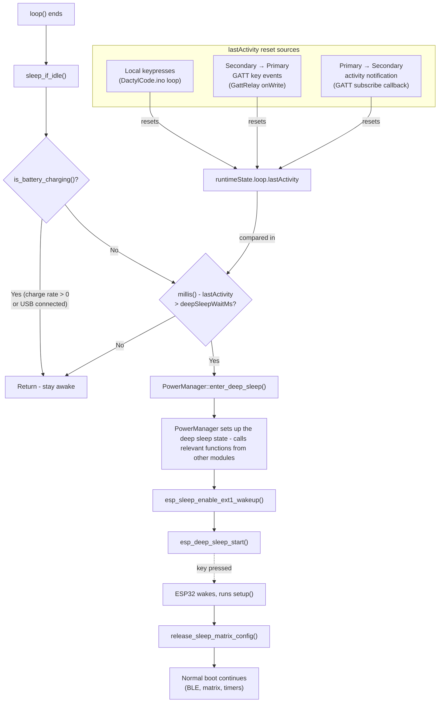
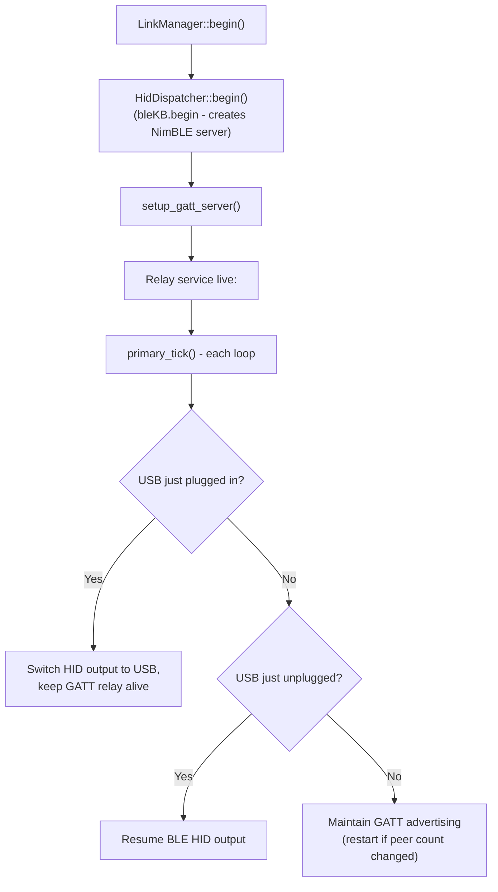
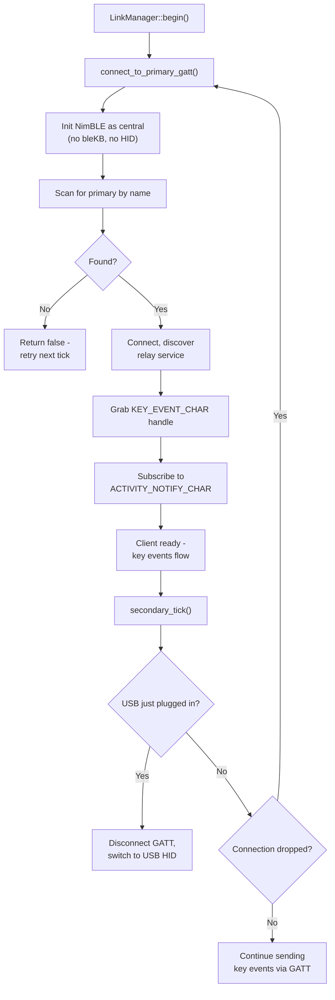
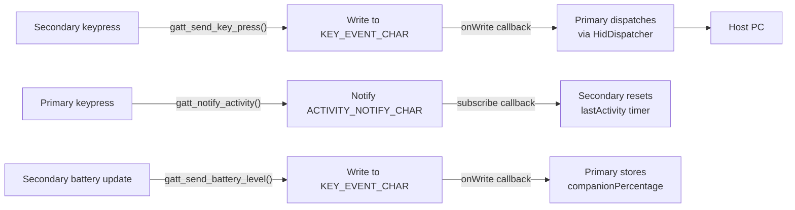

# DactylCode

This sketch is the firmware for my bluetooth split keyboard. The architecture is fairly simple, there is an overarching loop in the main sketch, and a load of handlers and resolvers which are each responsible for one thing (in theory). I've tried to have as little crossover as possible, and to use hooks to those handlers so that extensions should be relatively easy to make.

Some amount of configuration-passing is inevitable, but again I've done my best to make that reasonably ambivilent to changes in other modules. Where some state needs to be persisted, I've kept that on the `RuntimeState` module. I suppose I could have a `PowerState.h`, `LEDState.h` etc, and include them all in a central `RuntimeState` to make this even MORE modular, but honestly I think the current solution is good enough for this scale.

As a reminder,

| File | Purpose |
|------|---------|
| `DactylCode` | Main sketch - setup, loop, and action dispatch |
| `BoardConfig` | Shared struct definitions for board configuration |
| `MatrixScanner` | Scans the key matrix and tracks press/release state |
| `KeymapResolver` | Resolves pressed keys into actions (layers, toggles, etc.) |
| `HidDispatcher` | Sends resolved actions as HID key events via BLE |
| `LinkManager` | Manages the inter-board BLE GATT connection |
| `GattRelay` | Custom GATT service for wireless event relay |
| `PowerManager` | Battery monitoring and deep sleep |
| `StatusLed` | Status LED control (connected/disconnected indication) |
| `RuntimeState` | Runtime state structs (link, battery, matrix, LED, loop) |

## Deep Sleep logic

To save power, after a period of inactivity the boards can be configured to enter deep sleep. The boards are not physically connected, but they do form two halves of a whole and this makes the decision to go to sleep slightly harder - each half should ideally account for activity from it's partner before sleeping. To do that, there is also some GATT characteristics to communicate sleep activity and try and sync this between them. This flow diagram details the deep sleep thought process:

## GATT Relay

The GATT relay is the method by which the two halves communicate wirelessly. The primary half hosts a custom GATT service alongside the BLE HID keyboard service that talks to the PC. The secondary half connects as a client to this relay service and writes its key events into it. From there, the primary forwards them to the host as if they were its own keypresses. The flow of data is bi-directional - the secondary writes key events and battery levels up to the primary, and the primary pushes activity notifications back down to the secondary (so it knows not to fall asleep while the other half is in use).

### The service

The relay lives on a single GATT service (`RELAY_SERVICE_UUID`) with two characteristics:

| Characteristic | Direction | Purpose |
|----------------|-----------|---------|
| `KEY_EVENT_CHAR` | Secondary -> Primary | Key press/release/tap events and battery level updates. The secondary writes a short packet here and the primary's `onWrite` callback dispatches it to `HidDispatcher`. |
| `ACTIVITY_NOTIFY_CHAR` | Primary -> Secondary | Activity pings. The primary notifies this characteristic whenever it has local keypresses, so the secondary resets its sleep timer. Throttled to avoid BLE congestion. |

The packet format is pretty minimal - a one-byte event type followed by one or two payload bytes:

| Event | Byte 0 | Byte 1 | Byte 2 |
|-------|--------|--------|--------|
| Key press | `0x01` | keycode | - |
| Key release | `0x00` | keycode | - |
| Key tap | `0x02` | keycode low | keycode high |
| Battery level | `0x03` | percentage | - |
| Activity ping | `0x04` | - | - |

### Primary vs secondary roles

The primary half doesn't create its own NimBLE server - `bleKB.begin()` already does that as part of the HID setup. Instead, `setup_gatt_server()` grabs the existing server and bolts the relay service onto it. This means advertising and server callbacks are entirely owned by bleKB, and the relay just piggybacks. It's a bit of a dance, but it avoids the crashes I was getting from trying to manage advertising in two places.

The secondary half never calls `bleKB.begin()` at all, since it relies on the primary to send its keystrokes. It initialises NimBLE as a central, scans for the primary's name, connects, and grabs a handle to the key event characteristic. If the connection drops, `LinkManager` retries on its next tick. The secondary also subscribes to the activity notification characteristic so that keypresses on the primary half will keep it awake.

### USB fallback

One slightly tricky bit: when the primary is plugged into USB, it switches its HID output to USB but keeps the GATT relay alive. The secondary can still forward keystrokes over BLE, and the primary sends them out over the USB connection instead. If the _secondary_ gets plugged into USB, it disconnects from the primary entirely and acts as its own USB HID device - no relay needed.

#### Primary half (server)

#### Secondary half (client)

#### Data flow (steady state)

