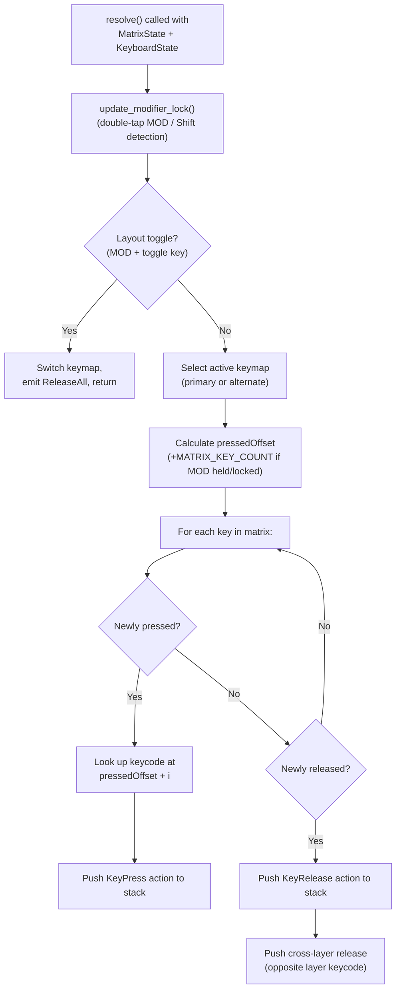
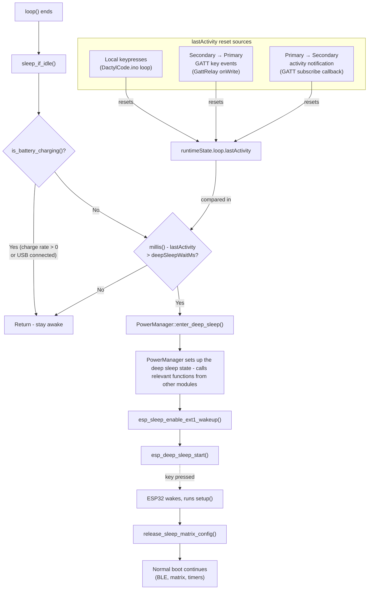
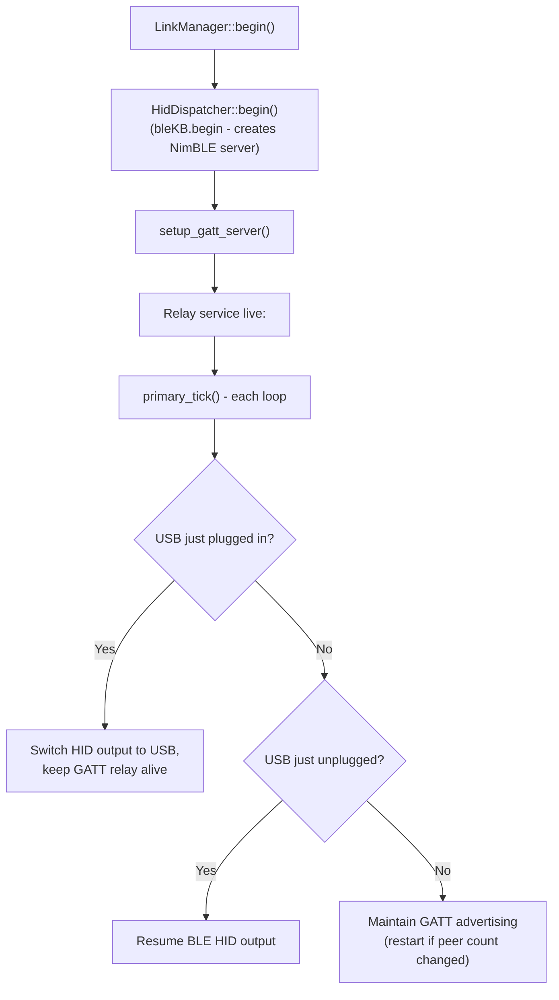
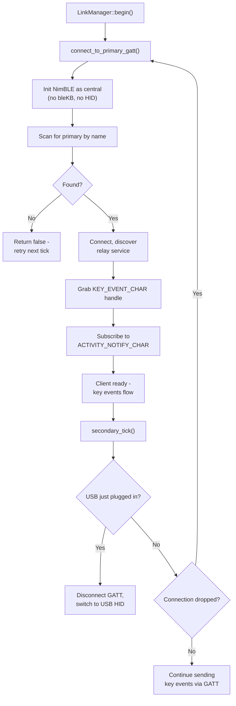
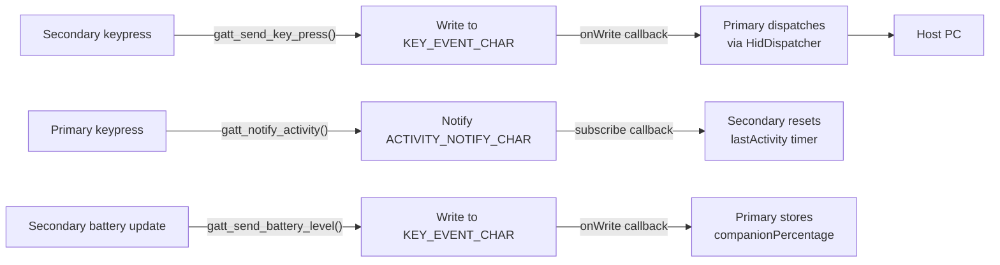

# DactylCode

This sketch is the firmware for my bluetooth split keyboard. The architecture is fairly simple, there is an overarching loop in the main sketch, and a load of handlers and resolvers which are each responsible for one thing (in theory). I've tried to have as little crossover as possible, and to use hooks to those handlers so that extensions should be relatively easy to make.

Some amount of configuration-passing is inevitable, but again I've done my best to make that reasonably ambivilent to changes in other modules. Where some state needs to be persisted, I've kept that on the `RuntimeState` module. I suppose I could have a `PowerState.h`, `LEDState.h` etc, and include them all in a central `RuntimeState` to make this even MORE modular, but honestly I think the current solution is good enough for this scale.

As a reminder,

| File | Purpose |
|------|---------|
| `DactylCode` | Main sketch - setup, loop, and action dispatch |
| `BoardConfig` | Shared struct definitions for board configuration |
| `MatrixScanner` | Scans the key matrix and tracks press/release state |
| `KeymapResolver` | Resolves pressed keys into actions (layers, toggles, etc.) |
| `HidDispatcher` | Sends resolved actions as HID key events |
| `LinkManager` | Manages the inter-board BLE GATT connection |
| `GattRelay` | Custom GATT service for wireless event relay |
| `PowerManager` | Battery monitoring and deep sleep |
| `StatusLed` | Status LED control (connected/disconnected indication) |
| `RuntimeState` | Runtime state structs (link, battery, matrix, LED, loop) |

Not all of these merit a deep explanation - I'll do quick explainers for the easy ones here.

- As mentioned, `RuntimeState` just holds the global states that are passed around between components.
- The `HidDispatcher` is literally just a wrapper around the BLE and USB keyboard libraries, with switches based on the runtime state to choose which to use.
- The `MatrixScanner` handles polling all the switches to see which ones are currently pressed. Populates a `MatrixState` which is just a simple boolean array.
- `BoardConfig` just defines the configuration options for the keyboard halves

## KeymapResolver logic

The `KeymapResolver` takes the raw boolean matrix from `MatrixScanner` and turns it into a list of `Action`s - press, release, tap, or release-all. It doesn't know or care about HID or BLE; it just figures out what to do and hands the result back to the main loop for dispatch.

The keymap itself is a flat array. Layer 0 occupies indices `0..MATRIX_KEY_COUNT-1`, layer 1 occupies `MATRIX_KEY_COUNT..2*MATRIX_KEY_COUNT-1`, and so on. When the modifier key is held (or locked), the resolver adds `MATRIX_KEY_COUNT` to each key's index before looking it up, which shifts the whole lookup into the next layer. A `-1` in the keymap is a no-op.

There's also support for an alternate base layout (e.g. a gaming layout). This is a completely separate keymap array, not just another layer. The resolver picks between primary and alternate keymaps based on a toggle state, and then applies the layer offset on top of that. The toggle is triggered by holding the modifier key and pressing a designated key - there are separate keys for "switch to typing" and "switch to gaming" so you always know which layout you're landing on, regardless of what state you were in before.

A few other bits worth noting:

- double-tap for Modifier lock (makes the LED flash to indicate lock)
- double-tap shift for caps lock
- Cross-layer release
    - When a key is released, the resolver also emits a release for the _other_ layer's keycode at that physical position. This prevents stuck keys when you let go of the modifier before letting go of a key - without it, you'd press `KEY_F1` (layer 1) but only release `KEY_Q` (layer 0), and the host would think F1 is still held.

The double-tap detection uses a configurable interval window with a minimum threshold to reject bouncy switches - `doubleTapIntervalMs` and `doubleTapMinIntervalMs` in the board config.

## StatusLed manager

The `StatusLed` module is pretty simple - it drives a single LED via the ESP32's LEDC PWM peripheral. There are four modes, and `update()` is called once per loop to set the output accordingly:

| Mode | Behaviour |
|------|-----------|
| `Off` | LED off, zero duty cycle. |
| `Disconnected` | Flashes on/off at the `disconnectedWaitMs` interval from the board config. Full brightness when on. |
| `Connected` | Solid on, half brightness. Dim enough that it's not annoying, bright enough that you know it's working. |
| `ConnectedModLocked` | Pulses between half and full brightness at 125ms intervals. This gives you a visual cue that the modifier layer is locked on. |

The `LedState` struct (in `RuntimeState`) tracks the current mode, output state, duty cycle, and flash timing. The mode is set externally - `LinkManager::tick()` sets it to `Connected` or `Disconnected` based on the connection state, and the `KeymapResolver` overrides it to `ConnectedModLocked` when the modifier is locked. The LED module itself doesn't make any decisions about the mode, it just renders whatever it's told.

Note that I chose to implement the LED states as reflecting a specific board state, rather than naming them things like "Flashing" or "On". This is because I didn't want to encourage a situation where two states share an LED pattern, and if the pattern usages were distributed throughout the code that would be hard to track.

## Deep Sleep logic

To save power, after a period of inactivity the boards can be configured to enter deep sleep. The boards are not physically connected, but they do form two halves of a whole and this makes the decision to go to sleep slightly harder - each half should ideally account for activity from it's partner before sleeping. To do that, there is also some GATT characteristics to communicate sleep activity and try and sync this between them. This flow diagram details the deep sleep thought process:

## GATT Relay and the LinkManager

The `LinkManager` is the orchestration layer that decides how each half talks to the host computer. It owns the connection lifecycle: initialising BLE or USB, detecting hot-plug events, reconnecting when things drop, and routing key events to the right place.

Actual wireless communication code is handled in the `GattRelay.h` module, not the link manager.

### LinkManager lifecycle

On startup, `LinkManager::begin()` sets up the connection. For the primary, this means calling `HidDispatcher::begin()` (which initialises NimBLE and the HID service) and then bolting the GATT relay service onto the same server. The secondary attempts to connect to the primary as a BLE central - if the primary isn't awake yet, the connection attempt fails quickly and tries again on the next tick.

Each loop iteration calls `LinkManager::tick()`, which does two things: run the role-specific tick (`primary_tick` or `secondary_tick`) and then update the LED mode based on connection state. The tick functions handle USB hot-plug detection and, for the primary, keep GATT advertising alive so the secondary can connect or reconnect.

### USB detection

The `check_if_usb_connected()` function is probably the most convoluted bit of the LinkManager, because it has to handle several combinations of USB and BLE state across both halves. It uses `tud_ready()` from TinyUSB rather than `tud_connected()` - on boards without VBUS sensing, `tud_connected()` stays true after physical unplug because there's no way to detect the cable is gone. `tud_ready()` goes false once SOF packets stop, which is a more reliable indicator that the host is actually there.

When USB is detected, the behaviour depends on the role:

#### Primary plugged into USB

Switches HID output to USB, but keeps the GATT relay alive. The secondary can still send keystrokes over BLE, and the primary forwards them out over USB instead of BLE HID. When USB is unplugged, it resumes BLE HID output - the GATT server was never stopped, so nothing needs restarting.

#### Secondary plugged into USB
Disconnects from the primary entirely and becomes its own standalone USB HID device. No relay needed - it talks to the host directly. When unplugged, it reconnects to the primary via GATT.

### Action dispatch

The main loop calls `dispatch_remote_action()` on the secondary when it needs to send a key event to the primary. This just wraps the GATT write functions (`gatt_send_key_press()`, `gatt_send_key_release()`, `gatt_send_tap_key()`) and routes based on the action type. On the primary side, incoming GATT writes trigger the `onWrite` callback in `GattRelay`, which dispatches directly to `HidDispatcher`.

The primary also calls `notify_activity()` after processing local keypresses, which sends an activity ping to the secondary over the `ACTIVITY_NOTIFY_CHAR` characteristic. This is how the secondary knows not to fall asleep while the primary half is in use.

### The GATT service

The relay lives on a single GATT service (`RELAY_SERVICE_UUID`) with two characteristics:

| Characteristic | Direction | Purpose |
|----------------|-----------|---------|
| `KEY_EVENT_CHAR` | Secondary -> Primary | Key press/release/tap events and battery level updates. The secondary writes a short packet here and the primary's `onWrite` callback dispatches it to `HidDispatcher`. |
| `ACTIVITY_NOTIFY_CHAR` | Primary -> Secondary | Activity pings. The primary notifies this characteristic whenever it has local keypresses, so the secondary resets its sleep timer. Throttled to avoid BLE congestion. |

The packet format is pretty minimal - a one-byte event type followed by one or two payload bytes:

| Event | Byte 0 | Byte 1 | Byte 2 |
|-------|--------|--------|--------|
| Key press | `0x01` | keycode | - |
| Key release | `0x00` | keycode | - |
| Key tap | `0x02` | keycode low | keycode high |
| Battery level | `0x03` | percentage | - |
| Activity ping | `0x04` | - | - |

### Primary vs secondary roles

The primary half doesn't create its own NimBLE server - `bleKB.begin()` already does that as part of the HID setup. Instead, `setup_gatt_server()` grabs the existing server and bolts the relay service onto it. This means advertising and server callbacks are entirely owned by bleKB, and the relay just piggybacks. It's a bit of a dance, but it avoids the crashes I was getting from trying to manage advertising in two places.

The secondary half never calls `bleKB.begin()` at all, since it relies on the primary to send its keystrokes. It initialises NimBLE as a central, scans for the primary's name, connects, and grabs a handle to the key event characteristic. If the connection drops, `LinkManager` retries on its next tick. The secondary also subscribes to the activity notification characteristic so that keypresses on the primary half will keep it awake.

### USB fallback

One slightly tricky bit: when the primary is plugged into USB, it switches its HID output to USB but keeps the GATT relay alive. The secondary can still forward keystrokes over BLE, and the primary sends them out over the USB connection instead. If the _secondary_ gets plugged into USB, it disconnects from the primary entirely and acts as its own USB HID device - no relay needed.

#### Primary half (server)

#### Secondary half (client)

#### Data flow (steady state)

